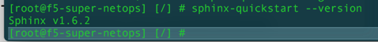
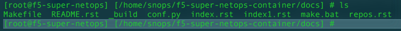
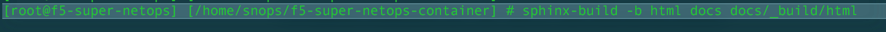
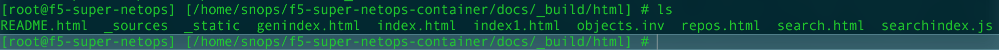
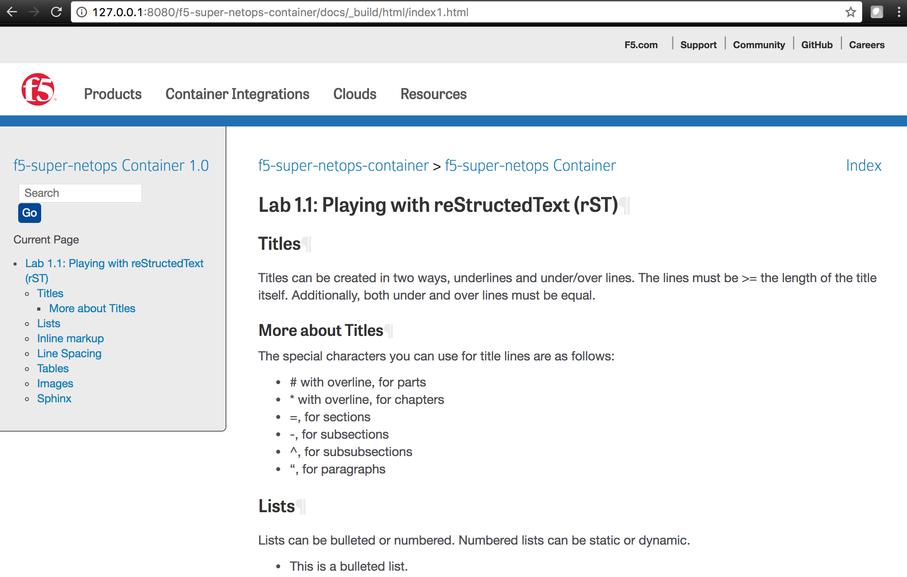
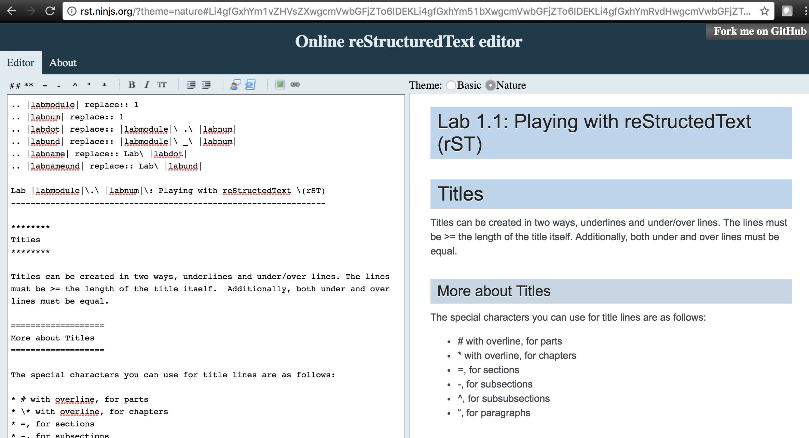

# rST
This reStructured Text tutorial was put together to provide a very basic overview of common rST structure as well as instructions for format validation using both the f5-super-netops-container Docker container as well as using rST Ninja.
<br>
# Using the f5-super-netops-container for rST validation
Using the f5-super-netops-container Jenkins variant, validate Sphinx is running.  The benefit of this method is that you can easily see how your document will look with the F5 specific theme.<br>
<br>
From your docker container:
```
sphinx-quickstart --version
```

<br>
<br>
Creating a new .rst file
Under /home/snops/f5-super-netops-continer/docs, create a new .rst file such as index1.rst
```
cd /home/snops/f5-super-netops-continer/docs
vi index1.rst
ls
```

<br>
<br>
Now run sphinx-build from the f5-super-netops-continer director.<br>
```
cd /home/snops/f5-super-netops-continer
sphinx-build -b html docs docs/_build/html
```

<br>
<br>
This now generated an html file for index1.html within the \_build/html folder.  You can view this file by navigating to the /home/snops/f5-super-netops-container/docs/\_build/html folder.
```
cd /home/snops/f5-super-netops-container/docs/_build/html
ls
```

<br>
<br>
You can now browse to index1.html hosted on the F5 container.
```
http://127.0.0.1:8080/f5-super-netops-container/docs/_build/html/index1.html
```

<br>
<br>
## Using rST Ninja for rST validation
For quick rST validation you can use rst ninja at http://rst.ninjs.org/.<br>
<br>

